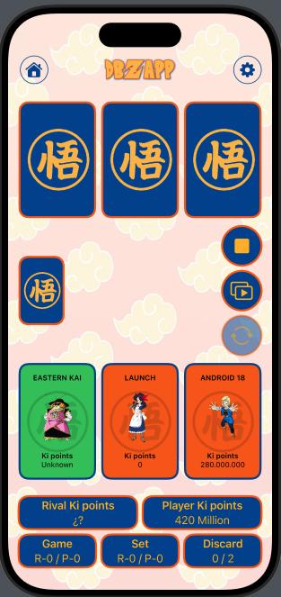

# DBZApp
A custom SwiftUI project featuring a Dragon Ball Z database and card game. Built with MVVM architecture, Async/Await for concurrency, Core Data for persistence, and a focus on reusable components, smooth animations and interactivity.

Users can explore a rich database of Dragon Ball Z characters or engage in an exciting card game.

##

## This app features

- **MVVM Architecture**: A clean and scalable architecture for managing UI and business logic.  
- **Concurrency with Async/Await**: Ensures a smooth and responsive user experience.  
- **Core Data Integration**: Allows users to persist their favorite characters locally.  
- **Reusable Components**: Modular UI elements for efficient development and consistent design.  
- **Custom Animations**: Smooth transitions and effects are used throughout the app to enhance user interaction. View components, such as buttons, feature custom animations for a dynamic and engaging experience.
- **Scalable Design**: Supports various screen sizes, including small iPhones (SE) and the big iPads (13").  
- **Offline and Online Modes**: Functions seamlessly with local JSON or live API calls.
- **Minimum Deployments**: iOS 17.5  

## Navigation  

The app is structured into the following main flows:  

1. **Splash View**  
   - Initial screen displaying the app's logo with a custom animation.  

2. **Landing View**  
   - Acts as a hub where users can navigate to:  
     - **Database**: Access the list of all characters.  
     - **Game**: Play the card game using characters from the database.  
     - **App Info**: Learn about the app and its features.  

3. **Database Flow**  
   - **HomeView**: Displays a list of all characters with sorting, filtering, searching and favorite functionalities. The user can also display a list of their favorite characters. 
   - **DetailView**: Shows detailed information about a selected character, including their attributes and description. The image URL can be shared with a dedicated button.
     - From the `DetailView`, the user can navigate further to:  
       - **TransformationView**: Explore the character's transformations.  
       - **PlanetView**: Learn about the character's origin planet.  

---

## Architecture  

The app follows a clean and modular architecture to ensure scalability and maintainability.  

### Layers  

1. **Presentation**  
   - **Components**: Reusable UI elements used across multiple views.  
   - **Sub-Views**: Smaller UI pieces that compose the main views.  
   - **Views**: Main screens of the app with their corresponding ViewModel.  

2. **Domain**  
   - **Repositories**:  
     - Protocols and implementations for managing data operations.  
   - **Use Cases**:  
     - Encapsulate business logic (e.g., fetching character details, managing favorites).  

3. **Data**  
   - **Data Sources**:  
     - **Local**: Fetches data from the a local JSON.  
     - **Network**: Fetches data from the API.
     - **Favorite**: Fetches favorited characers with Core Data.  

4. **Model**  
   - Represents the data structures used in the app, such as `Character`, `DetailedCharacter`, `GameCharacter`, etc.  

### Features of this Architecture  
- **Separation of Concerns**: Ensures that each layer has a clear responsibility.  
- **Scalability**: New features can be added without disrupting existing code.  
- **Testability**: ViewModels and Use Cases can be independently tested.  

---

## Game Mode  

The game mode in DBZApp is a dynamic and interactive card game that combines strategy, luck, and animations.  

### Key Features  

- **Customizable Gameplay**:  
  - The user can configure the duration of the match, tailoring the experience to their preferences. The configuration is saved using UserDefaults.

- **Joker & Malus Logic**:  
  - Cards with `unknown` ki values act as jokers, multiplying the total points of the hand.  
  - The malus card reduces the total points of the hand.

- **Animations**:  
  - Built entirely using SwiftUI, the game features smooth transitions and animations for actions like selecting, discarding, and drawing cards.  

- **Sound Effects**:  
  - Enhanced with audio feedback powered by AVFoundation, adding an immersive layer to the gameplay.  

- **Turn-Based Strategy**:  
  - Compete against the AI in a best-of-X format (the user can customize it), where each round requires strategic card selection to outscore the opponent.

- **Clear rules**:
  - The user can access a dedicated view to understand the game rules in detail.   

---

## Customization and Design  

- **Light & Dark Mode Support**:  
  - The app dynamically adapts to the system's light or dark mode, ensuring a consistent and visually appealing experience in both themes.  

- **Custom Font**:  
  - "Saiyan-Sans" is used across the app to enhance the Dragon Ball Z aesthetic.  

- **Custom Color Set**:  
  - The app utilizes a tailored color palette (blue, orange, yellow) aligning with the Dragon Ball Z theme.

- **Custom Designs**:  
  - Custom image resources have been created specifically for the app, including the app logo, header logo, and card backgrounds.

---

## Frameworks  

The app leverages the following frameworks:  

- **SwiftUI**: For building a declarative and reactive UI.
- **SwiftfulRouting**: To manage the app's navigation seamlessly.
- **SwiftfulUI**: For enhancing UI elements, such as `.stretchyHeader` and `.asButton`.  
- **Core Data**: For local data persistence (favorite management).  
- **Kingfisher**: For efficient handling of images downloaded from the internet.
- **ConfettiSwiftUI**: For showing an star animation when user favorites a character.
- **AVFoundation**: For integrating sound effects during gameplay.
 
---

## Enums  

Enums used in the app: FilterOption, SortOption, UseCaseError, GameAlert, GameText. 

---

## View Modifiers  

Reusable view modifiers include:  CardFlipModifier, CardPositionModifier, SensoryTriggerModifier, ZoomPanModifier.  

---

## KiFormatter
KiFormatter is a utility class used to handle the different formats and conversions for ki points in the app. It serves multiple purposes

---

## Installation
- To run the app locally, clone the repository and open the project in Xcode. Then, build and run the project in the simulator or on a physical device.
- To test the app, you can do it using Appetize, [click here](https://appetize.io/app/b_onavyvjpgggkwsyrpldzrpkuzm).

---

## Contributing
Contributions are welcome! If you want to contribute, please fork the repository, create a new branch, make your changes, and submit a pull request.

---

## License
This project is licensed under the MIT License - see the [LICENSE](LICENSE) file for details.
 

---

## Color Reference

| Color      | Hex                                                                |
| ---------- | ------------------------------------------------------------------ |
| DBZBlue    |  #1C4595   |
| DBZOrange  |  #E76A24   |
| DBZYellow  |  #FBBC42   |

---

## Screenshots
Below are some screenshots showcasing key views and features of the app.

    
    
     
  

    
    
     
  

  

    
    
     
  

    
    
     
  

    
    

